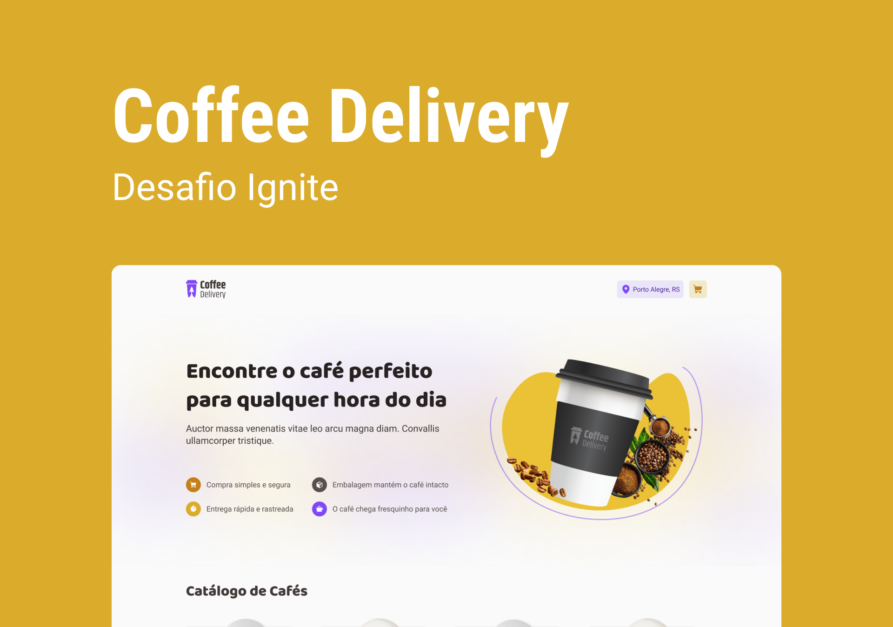

<h4 align="center">
    
</h4>

<p align="center">
  Coffee Delivery 🚀
  <br>
  <br>

  

  <a href="https://rocketseat.com.br">
    
  </a>

  <a href="https://github.com/LMThomaz/coffee-delivery/commits/master">
    
  </a>

  
</p>

## :mag: Sobre o projeto

Peça logo seu café sem perder tempo e sem dor de cabeça, como desafio da [Rocketseat :rocket:][url-rocketseat] na versão **Ignite ReactJS** :coffee:  
A criação do projeto veio como um desafio para a utilização de algumas bibliotecas e _hooks_, tais como: _useReducer_, _react-hook-form_, _useContext_, _zod_.

## :art: O protótipo?

O layout da aplicação está disponível no [Figma][url-figma]  


## :books: Bibliotecas?

O projeto utiliza as seguintes bibliotecas:

- [React][url-react]
- [TypeScript][url-ts]
- [React Hook Form v7][url-hook-form]
- [Immer][url-immer]
- [Json Server][url-json-server]
- [Phosphor Icons][url-phosphor-react]
- [Zod][url-zod]

## :electric_plug: Como usar?

> :bulb: O projeto web depende que o server esteja sendo executado para seu funcionamento.

## :hand: Pré-requisitos

É **necessário** que tenha instalado em sua máquina:

- [Git][url-git]
- [NodeJS][url-node]
- Um gerenciador de pacotes como o [NPM][url-npm]

## :package: Como clonar a aplicação?

```bash
# Clonar o repositório
$ gh repo clone https://github.com/LMThomaz/coffee-delivery
```

## :rocket: Como executar a aplicação?

```bash
# Instalar as dependências
$  npm install

# Iniciar o mock de dados (json server)
$ npm run server

# Iniciar o projeto
$ npm run dev
```

## :coffee: Como posso ajudar?

1. Faça o Fork deste repositório
2. Comece uma branch com sua feature

```bash
$ git checkout -b minha-feature
```

3. Confirme (Commit) seus feitos

```bash
$ git commit -m 'Minha nova feature'
```

4. Suba (push) sua branch

```bash
$ git push origin minha-feature
```

## :page_with_curl: Licença

O projeto está utilizando a licença MIT. Confira [LICENSE][license] para mais detalhes.

---

<h4 align="center">
Feito com 💜 por <a href="https://www.linkedin.com/in/leonardo-thomaz/" target="_blank">Leonardo Thomaz</a>
</h4>
 
[url-figma]: https://www.figma.com/file/vnswY9FogOWnVGgbtqZE4v/Coffee-Delivery?node-id=0%3A1&t=TB0PDTXaiiHps8MD-1
[url-ts]: https://www.typescriptlang.org/
[url-react]: https://reactjs.org/
[url-hook-form]: https://react-hook-form.com/get-started
[url-rocketseat]: https://rocketseat.com.br/
[url-immer]: https://immerjs.github.io/immer/
[url-json-server]: https://github.com/typicode/json-server
[url-phosphor-react]: https://phosphoricons.com/
[url-zod]: https://zod.dev/
[url-git]: https://git-scm.com/
[url-node]: https://nodejs.org/en/
[url-npm]: https://www.npmjs.com/
[license]: https://github.com/LMThomaz/coffee-delivery/blob/master/LICENSE.md
